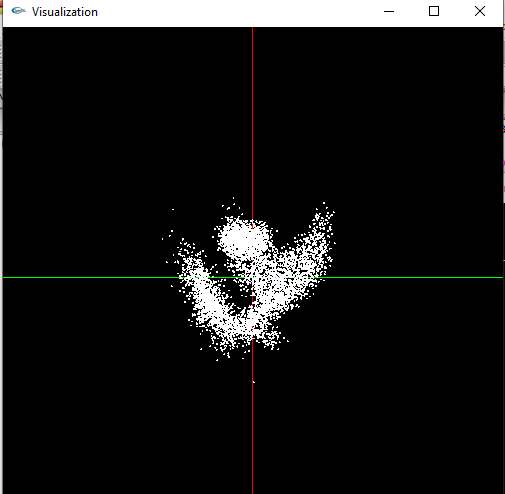

# 3D-Dataset-Analyzer
- This project is about a program that takes a 3D dataset file and visualizes it using openGL.

**Features**

- Scrolling (WASD)
- Zoom in/out (+/-)
- Menu options

**Sample**

For example type in banana.dat in the console.

